# Proceso de replicación de base de datos SQL (Master - Master)
Para comprender el proceso de replicación de una base de datos, es necesario recalcar que, la base A se replicará en B y visceversa, ya que, son procesos bidireccionales. El proceso de replicación se realiza con una lista de comandos específica.

## Lista de comandos
### Servicio de Wordpress
1. Inicialización de Docker Compose <code>dockes-compose up -d</code>

                                        


    La inicialización del Docker Compose permite crear una composición de contenedores con un fin específico, centrado en generar una conjunto de herramientas destinadas a una tarea en concreta y, enlazando estos elementos entre sí.

    

    > [!CAUTION]
    > Si se reinicia el contenedor, al volver a cargarlo dará problemas con la conexión de puertos. Para solucionar esto es importante eliminar volumenes y contenedores, y reiniciar el Docker Core.

2. Abrimos el contenedor de Wordpress y procedemos a instalar el servicio. Se agrega un correo, usuario y contraseña, los cuales son:

     

    - usuario: ingrithrevelo
    - correo: prueba@recuperacion.com
    - contraseña: pruebaIngrith2024

      

   > [!TIP]
   >  Estas credenciales nos permiten acceder al servicio de Wordpress y poder crear nuestra página o blog. 
   > Es importante recordar que, los servicios que se proveen a través de un Docker Compose son de uso local por lo cual, cada vez que iniciemos el servicio, se deberá configurar nuevamente cada apartado.


3. Una vez realizada la configuración de Wordpress, crearemos un formulario con la herramienta Forminator (ubicada en la tienda de plugins). 

    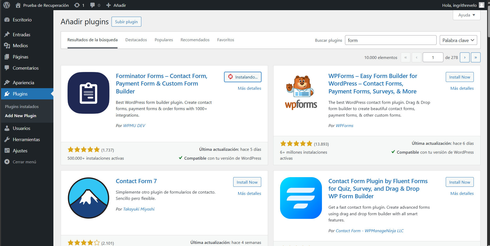

    En este caso, el formulario será de tipo **_Solicitud de presupuesto_**, otorgando una estructura compleja. 

    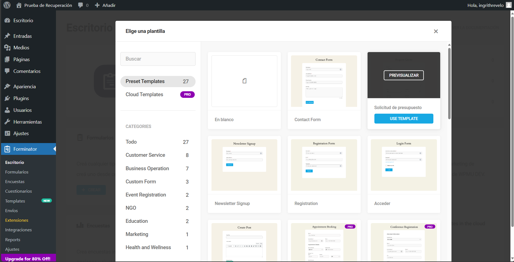

    Dentro de la estructura del formulario podemos modificar los parámetros y variables que serán asignados a cada campo del mismo. En este caso, se usarán los predeterminados. 

    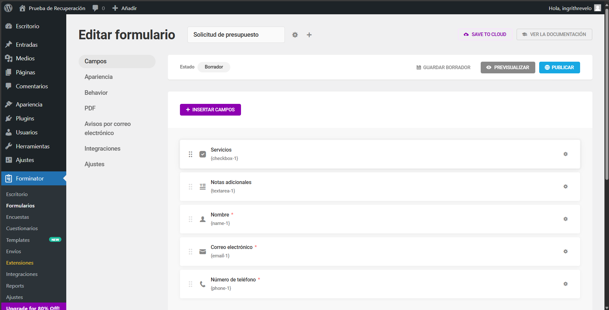

    Una vez generado el formulario se presentará una etiqueta de metadatos con el identificador del mismo; este debe ser copiado y pegado en la seccióno página que se desee utilizar.

    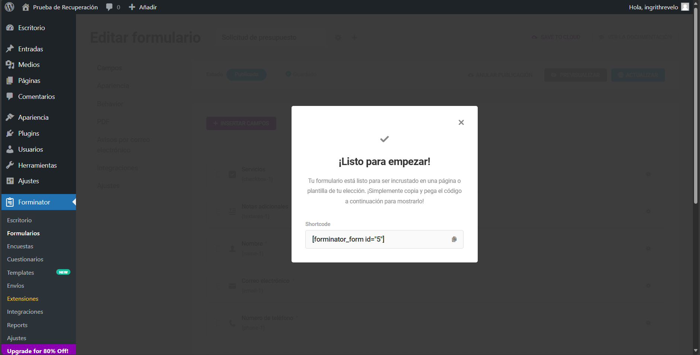

4.  Para insertar el fomrulario, se hará uso de una plantilla básica de Wordpress, y, el mismo será colocado en la sección de inicio (para facilitar el acceso a este.) Empleando la etiqueta <code>[forminator_form id="<id_num>"]</code> se embendará el formato final.

    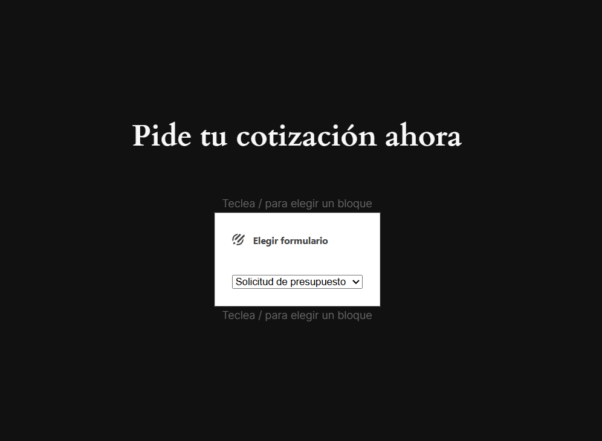

    Una vez guardado el formulario y publicada la plantilla, se obtiene la forma final del mismo y se puede agregar cualquier infomarción.

    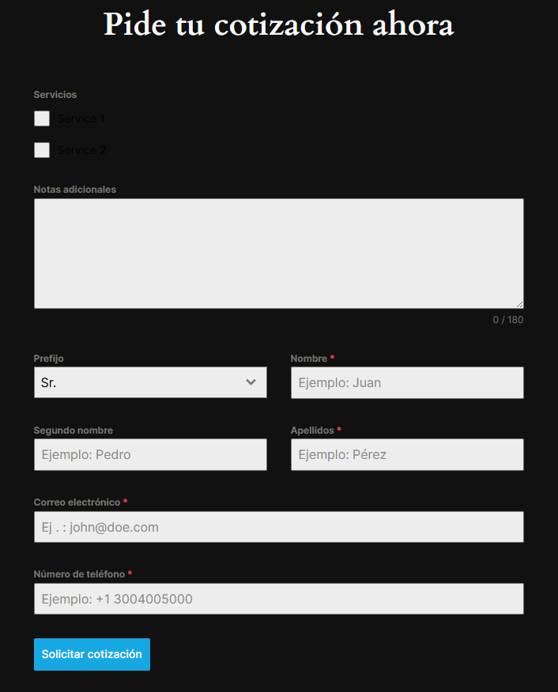

    Para poder identificar los datos que se suban a la base, su usarán lso siguientes datos, los cuales estarán albergados en el archivo [de datos de este repositorio.](./resources/data.txt)

    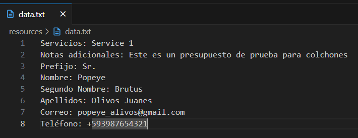
    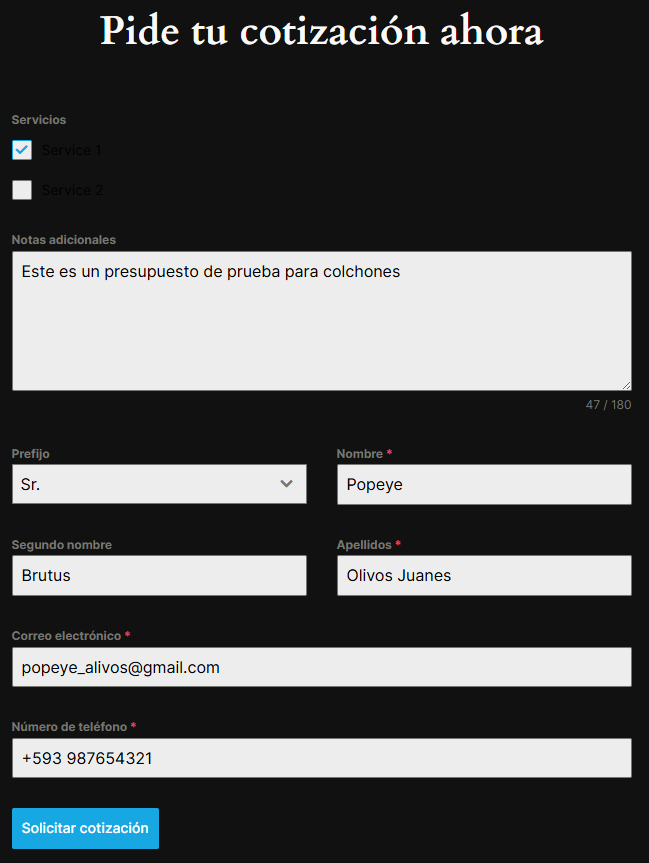

    Estos datos son enviados hacia la base principal (la base Maestra A). Con estos datos enviados, se procede a realizar el proceso de replciación entre la base A y la B, ambas de clase maestra.

### Replicación de Base de Datos
5. Para el proceso de replicación, accederemos a cada una de las bases de datos de MySQL desde dos navegadores diferentes. En este caso, el servicio se encuentra alojado en el contenedor de PHP MyAdmin, que trabaja con el puerto 8083.  
Los navegadores a emplear son:
    - **Microsoft Edge** (para Master A) - en la parte izquierda
    - **Arc Browser** (para Master B) - en la parte derecha

    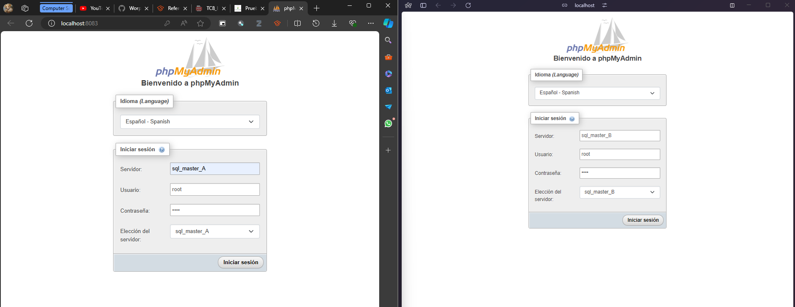

    Una vez ingresadas en ambas bases de datos, con las credenciales "root":"root", se puede distinguir cada base de datos por su etiqueta respectiva de servidor. 

    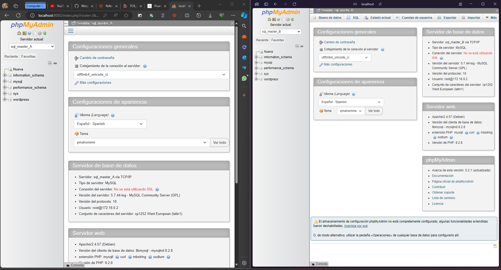

6. Para corroborar el correcto guardado de los datos del formulario, emplearemos la sección de **BASE DE DATOS** de la Master A. Dentro de la base de nombre __**wordpress**__, especificamente en la tabla de *__wp_frmt_form_entry_meta__* se encontrarán los datos mencionados. 

    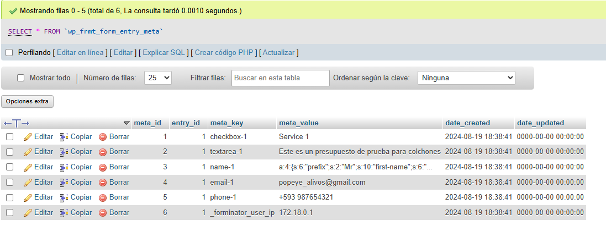

    También, a través de una consulta SQL con la siguiente estructura, se pueden obtener los mismos elementos:
    <p align="center"><code> USE wordpress;<br/> SELECT * FROM `wp_frmt_form_entry_meta`; </code></p>

    <center>
        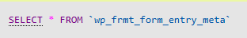
    </center>  

    <br/>

    > [!IMPORTANT]
    > La base de datos *_"wordpress"_* en el servicio SQL Maestro B debe estar vacía. Si la sincronización ha sido exitosa, todos los datos de la misma base en Maestro A serán replicados y almacenados en B.
    
    > 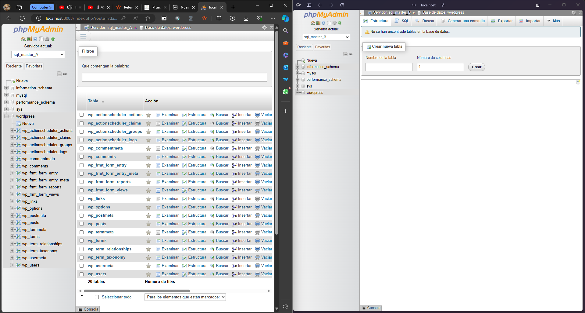

7. El proceso de replicación de la base de datos se realizará tratando ambas bases como maestras y esclavas a la vez, es decir, empleando los comandos de "Slave Replication" y los "logs" de A en B y visceversa. 

    Las configuraciones seránr realizadas desde la consola SQL itegrada en PHPMyAdmin, desde cada servidor. Los pasos a realizar son los siguientes:

    **a. Creación de un usuario de replicación:** La creación de un usuario es importante, tanto para garantizar seguridad a la base de datos como delegar un miembro de grupo que se encargue de las replicaciones únicamente. Este usuario es el mismo para ambos servidores Maestros A y B.

    Este paso es opcional. Si quieres agregar la replicación al usuario "root", debemos dirigirnos al apartado siguiente.

    Todo esto se ha realizado con el comando:
    ```
    CREATE USER 'replica'@'%' IDENTIFIED BY 'replica_pass';
    GRANT REPLICATION SLAVE ON *.* TO 'replica'@'%';
    FLUSH PRIVILEGES;
    ```

    - Master A
      
        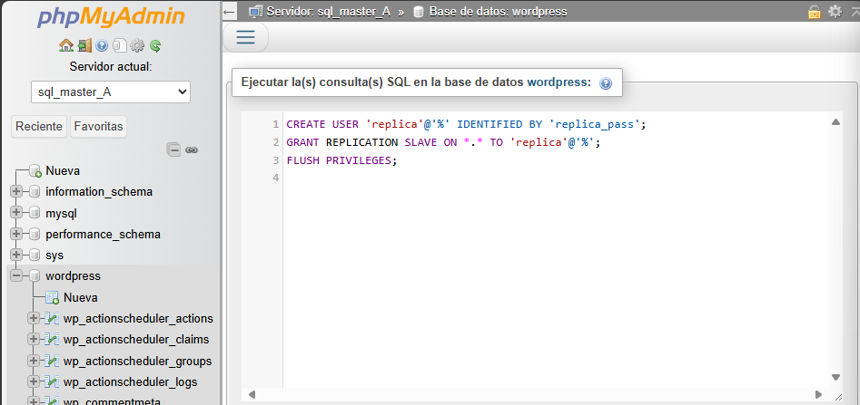

    - Master B
      
        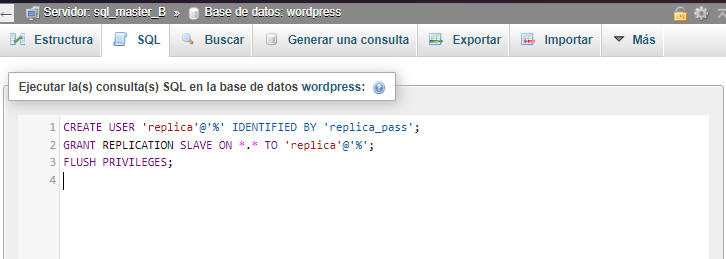

    **a.1. Sincornización inicial:** Es importante que la base wordpress en Master A y B tengan los mismos datos. Como la base en B está vacía, se debe importar la base de datos de A como una copia de seguridad.

    Para este caso, las experotaciones se harán tabla por tabla y evitar problemas de carga por excendete de tamaño. El proceso puede ser largo debido a la "n" cantidad de tablas con las que cuenta la base de datos. 

    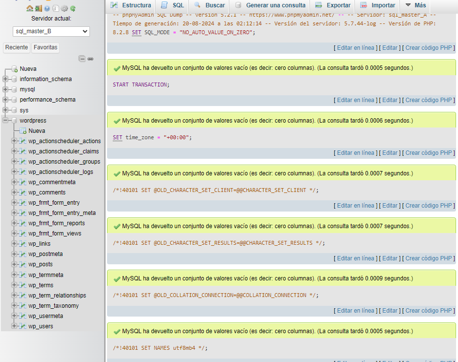
    
    **b. Información del estado del maestro:** Obtener la información del estado de las bases maestras es importante para identidicar la configuración y el acceso a la información, de forma bidireccional y en persistencia. 
    Para esto, es necesario ejecutar el comando <code>SHOW MASTER STATUS</code> en cada una de las bases y obtener el bianrio de MySQL y la posición. 

    - Comando ejecutado en ambas bases
      
        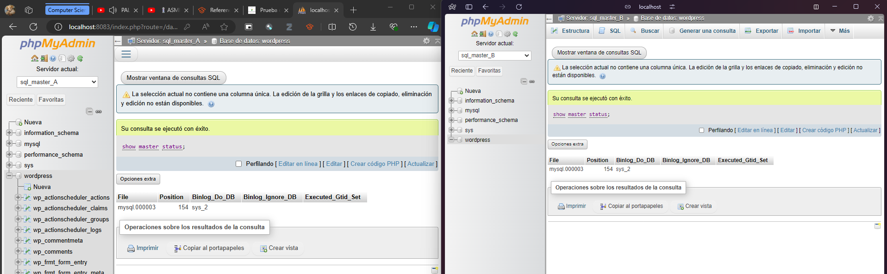

    Al habver sido iniciados por un mismo servicio de PHPMyAdmin, los archivos de binlog y posición son los mismos en ambas bases. Si ambos maestros tienen datos iguales, los archivos de binlog y las posiciones pueden coincidir temporalmente. La replicación debería comenzar a diferenciarse después de que se realicen transacciones adicionales.

    **c. Cambio de posición y binlog:** Este proceso permite identificar y modificar los archivos binarios de la base de datos de la cual (o a la cual) se requiere realizar una replicación. Esto se realiza mediante el comando:

    ```
    CHANGE MASTER TO
    MASTER_HOST='sql_master_B',
    MASTER_USER='replica', --> Omitir si la replicación se hace con root user
    MASTER_PASSWORD='replica_pass', --> Omitir si la replicación se hace con root user
    MASTER_LOG_FILE= '<binlog>', 
    MASTER_LOG_POS= <position> 
    START SLAVE;
    ```
    Este cambio se debe realizar en ambos servicios, y, al poseer datos iguales, se presenta una captura general de estos. El único cambio a realizar consiste en usar el nombre del **host de A en B** y visceversa. 

    - Master A
  
    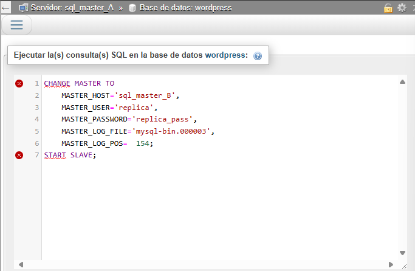

    - Master B
      
    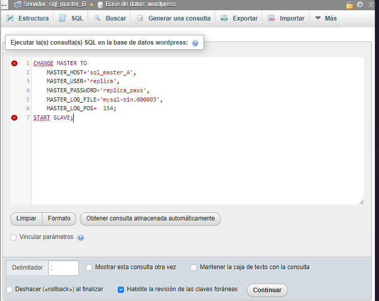

    **d. Muestra de estados de bases esclavas:** Como para este proceso ambas bases de datos fueron tratadas como esclavas, se proceder a mostrar el estado de la comunicación con el comando <code>SHOW SLAVE STATUS</code>.

    - Master A
      
    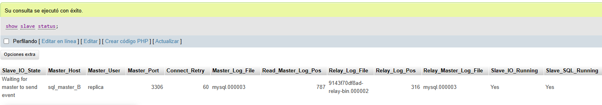

    - Master B
      
    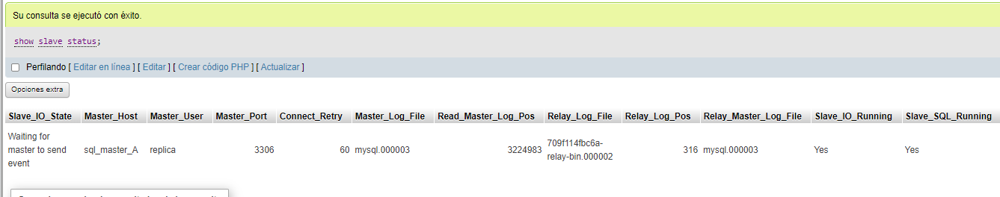

        i. _Si **"SLAVE_IO_RUNNING"** es igual a _**"NO"**_: En caso de que exista este error, es necesario revisar si en el Docker compose, la sección de **command** tenga escrito correctamente los siguientes parámetros:
        
        ``` 
            --server-id=2 -> El id del servidor debe ser único para cada base o servicio
            --log-bin=mysql -> El log bin siempre debe ser de tipo mysql
            --binlog-do-db=wordpress -> Debe estar el nombre de la base de datos, caso contrario, fallará la replicación. 
            --auto-increment-increment=2 
            --auto-increment-offset=2
        ```
        También, se debe iniciar sesión en el usuario creado para la replicación; en este caso **"replica":"replica_pass"** y cerrar sesión. Nuevamente se debe inicar sesión como usuario root en ambas bases de datos y verificar el estado del MASTER. Si los valores son diferentes, se debe realizar el proceso de configuración nuevamente. 
    
    **e. Verificación de replicación:** Una vez comprobado que el servicio de Esclavos este activo, ingresamos nuevamente algunos datos aletorios al fomrulario y debemos verificar que toda la información de la base de datos en Master A (base, tablas y datos) se haya replicado en Master B.

    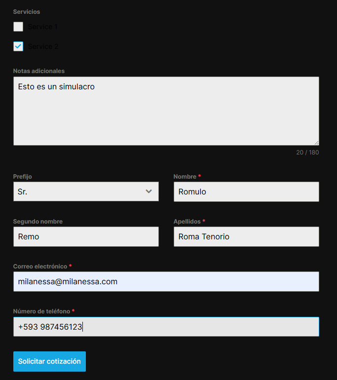
    
